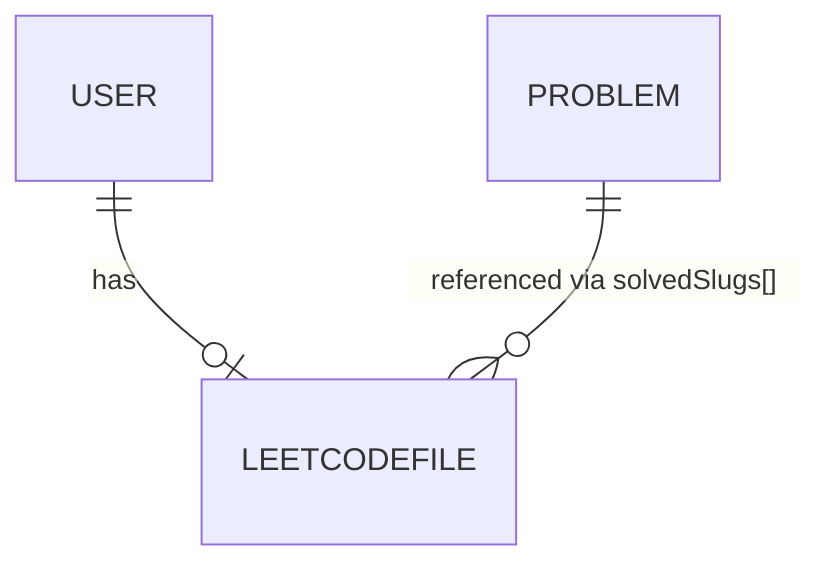

# Database Schema — AI LeetCode Coach

Database: **MongoDB** (Mongoose 9). Three collections: `users`, `leetcodeprofiles`,
`problems` (new).

## 1. Entity relationship



- `LeetCodeProfile.userId` → `User._id` (1:1, unique).
- `LeetCodeProfile.solvedSlugs[]` and `lastRecommendations.items[].slug` reference
  `Problem.titleSlug` logically (not a DB-level FK — Mongo has none).

---

## 2. `users` (existing)

```javascript
{
  name:        String   // required, 2–60 chars
  email:       String   // required, unique, indexed, lowercase
  password:    String   // required only for local non-guest (min 8), select:false
  googleId:    String   // unique, sparse, indexed
  avatar:      String
  provider:    'local' | 'google'   // default 'local'
  role:        'user' | 'admin'     // default 'user'
  isGuest:     Boolean              // default false
  timestamps:  true                 // createdAt, updatedAt
}
```

**Indexes:** `email` (unique), `googleId` (unique sparse).

---

## 3. `problems` (new — Striver DSA sheet)

One document per Striver-sheet problem.

```javascript
{
  titleSlug:  String   // unique, indexed  e.g. "two-sum"
  title:      String   // "Two Sum"
  difficulty: 'Easy' | 'Medium' | 'Hard'
  topic:      String   // Striver category, indexed  e.g. "Arrays", "DP", "Graph"
  tags:       [String] // optional LeetCode tags for display
  url:        String   // https://leetcode.com/problems/two-sum/
  paidOnly:   Boolean  // default false — excluded from "fresh" picks
  index:      Number   // optional Striver order (stable tie-breaker / progression)
}
```

**Indexes:** `titleSlug` (unique), `topic`, `difficulty`.

Seeded by `server/scripts/importStriverSheet.js` (upsert on `titleSlug`).

---

## 4. `leetcodeprofiles` (existing, extended)

```javascript
{
  userId:           ObjectId   // → User, required, unique, indexed

  // identity
  leetcodeUsername: String     // required, indexed, lowercase
  realName:         String
  ranking:          Number
  reputation:       Number
  avatar:           String
  country:          String
  school:           String
  github / linkedin / twitter / website: String

  // solved stats
  easySolved:       Number
  mediumSolved:     Number
  hardSolved:       Number
  totalSolved:      Number
  solvedSlugs:      [String]   // full accepted-submission slugs (NON-INDEXED scan OK,
                               // indexed if >~10k users)
  acceptanceRate:   Number
  contributionPoints: Number

  // activity
  heatmap:          Mixed      // submissionCalendar
  calendar:         { activeYears[], streak, totalActiveDays }
  badges:           [ { badgeId, displayName, icon, creationDate } ]
  contestRating:    Number
  contestGlobalRanking: Number | null
  contestTopPercentage:  Number | null
  recentSubmissions: [ { submissionId, title, titleSlug, timestamp,
                         statusDisplay, lang } ]

  // recommendations (Phase 4)
  lastRecommendations: {
    count:        Number
    source:       'gemini' | 'heuristic'
    generatedAt:  Date | null
    items: [ {
      slug:       String
      title:      String
      difficulty: 'Easy' | 'Medium' | 'Hard'
      topic:      String
      tags:       [String]
      url:        String
      rationale:  String
      kind:       'revision' | 'fresh'   // NEW field
    } ]
  }

  lastSyncedAt:    Date
  timestamps:      true
}
```

---

## 5. Sample documents

### `problems` (one row)

```json
{
  "titleSlug": "two-sum",
  "title": "Two Sum",
  "difficulty": "Easy",
  "topic": "Arrays",
  "tags": ["Array", "Hash Table"],
  "url": "https://leetcode.com/problems/two-sum/",
  "paidOnly": false,
  "index": 1
}
```

### `leetcodeprofiles.lastRecommendations`

```json
{
  "count": 5,
  "source": "gemini",
  "generatedAt": "2026-08-26T10:00:00.000Z",
  "items": [
    {
      "slug": "trapping-rain-water",
      "title": "Trapping Rain Water",
      "difficulty": "Hard",
      "topic": "Arrays",
      "tags": ["Array", "Two Pointers", "Stack"],
      "url": "https://leetcode.com/problems/trapping-rain-water/",
      "rationale": "Weak in two-pointer patterns; reinforces array traversal.",
      "kind": "revision"
    },
    {
      "slug": "course-schedule",
      "title": "Course Schedule",
      "difficulty": "Medium",
      "topic": "Graph",
      "tags": ["Graph", "Topological Sort"],
      "url": "https://leetcode.com/problems/course-schedule/",
      "rationale": "Introduces topological sort in an under-practiced topic.",
      "kind": "fresh"
    }
  ]
}
```

---

## 6. Referential integrity notes

- Mongo has no FK constraints; integrity is enforced in service code.
- On `disconnect`, only `LeetCodeProfile` (and its `lastRecommendations`) is removed —
  `Problem` rows are global and shared across users.
- `solvedSlugs` can grow large (~few thousand); it is stored inline for simplicity. If
  it becomes a bottleneck, extract to a separate `UserProblem` (`userId`, `slug`) indexed
  collection and compute set membership via `$in`.
