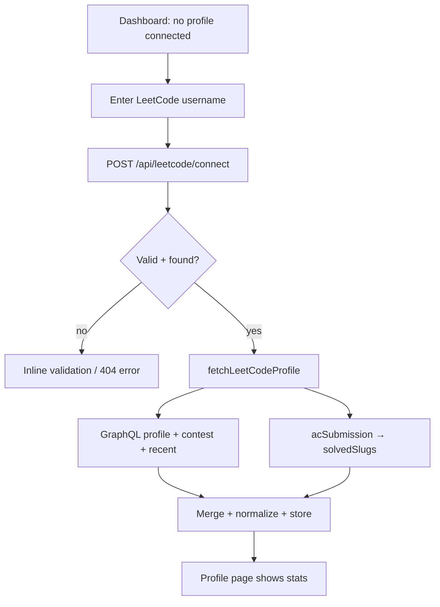
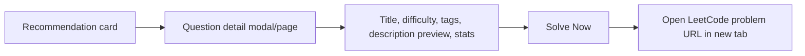

# User Flows — AI LeetCode Coach

## 1. Onboarding & auth

```mermaid
flowchart TD
    A[Landing page] --> B{Has account?}
    B -- no --> C[Register]
    B -- yes --> D[Login]
    B -- just browsing --> E[Continue as Guest]
    C --> F[Email/password form]
    D --> F
    F --> G[POST /api/auth/register | login]
    G --> H[HttpOnly JWT cookie set]
    H --> I[Dashboard]
    E --> J[POST /api/auth/guest]
    J --> I
```

Google sign-in path: **Landing → "Continue with Google" → Google consent → idToken →
`POST /api/auth/google` (auto-register) → Dashboard.**

Guests are authenticated but `isGuest=true`; LeetCode routes (`recommendations` included)
reject guests — they must register/login to connect a profile.

## 2. Connect LeetCode profile



The solved-slugs fetch is **best-effort**: if it fails, connect still succeeds but
`solvedSlugs` is empty (recommendations become less personalized).

## 3. Generate recommendations (primary flow)

```mermaid
flowchart TD
    A[Recommendations page] --> B{Profile connected?}
    B -- no --> C[Prompt to connect username]
    B -- yes --> D{Have lastRecommendations?}
    D -- yes --> E[Show cached set + 'Regenerate']
    D -- no --> F[Show empty state]
    E --> G[Set knobs]
    F --> G
    G[Set Total N] --> H[Set Revision S]
    H --> I[Click Generate]
    I --> J[POST /api/leetcode/recommendations<br/>{ total, solvedSplit }]
    J --> K[Engine: partition → weak topics → Gemini/heuristic]
    K --> L[200 { source, revision[], fresh[] }]
    L --> M[Render two groups]
    M --> N[Click a problem → Question detail]
    N --> O[Solve on LeetCode]
```

## 4. Sync & disconnect

```
Profile/Settings → "Sync"   → POST /api/leetcode/sync   → re-fetch, diff changed fields
Profile/Settings → "Delete" → DELETE /api/leetcode/disconnect → remove stored profile
```

## 5. Question detail → solve



## 6. Guest vs. registered

| Action | Registered | Guest |
| --- | --- | --- |
| View landing / login / register | ✅ | ✅ |
| Browse dashboard shell | ✅ | ✅ (limited) |
| Connect LeetCode profile | ✅ | ❌ |
| Generate recommendations | ✅ | ❌ |
| Sync / disconnect | ✅ | ❌ |

## 7. Error & edge-case paths

- **Username not found** → 404 surfaced inline on the connect form.
- **Already connected** → 409 ("Use Sync to refresh").
- **LeetCode down / rate-limited** → 502 with a friendly message; solved-slugs silently
  degrades.
- **Gemini missing/error** → recommendation still returns with `source: "heuristic"`.
- **`solvedSplit > total`** → 400 validation error before any work.
